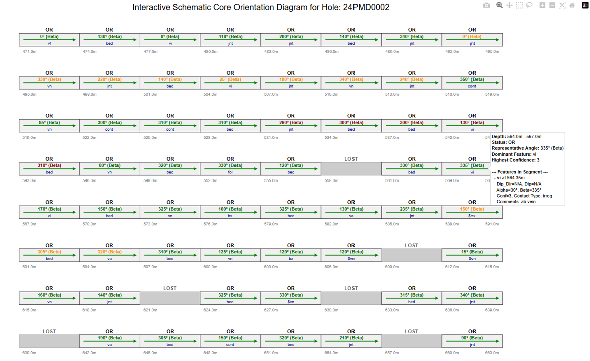

# Core Bamboo Diagram Generator

This tool generates an interactive schematic "bamboo" diagram from drill core structural orientation data, specifically designed for geologists to quickly visualize structural trends and data gaps.

## Interactive Bamboo Diagram Example

Here's a preview of the interactive plot:



Click [here to view the full interactive plot live!](https://radixplore-labs.github.io/core-bamboo-diagram/outputs/bamboo_diagram.html)

## Features

* Parses tab-separated `.txt` files containing structural measurements (e.g., `STRUCTURE-EIS-24PMD0002.txt` format), expecting a 'H1000' header row for column names.

* Generates schematic core segments, classifying them as "Oriented" (OR) or "Lost" (LOST).

* Displays representative orientation angles (Dip Direction or Beta) and dominant structural feature types directly on the segments.

* Provides interactive hover popups with detailed information for each segment, including all features within that interval, their angles, confidence, contact types, and comments.

* Allows customization of plot layout parameters (segment length, core height, row spacing, segments per row, segment width) via command-line arguments.

* Outputs an interactive HTML plot that can be shared and viewed in any web browser.

## Installation

1.  **Clone the repository:**
    ```bash
    git clone [https://github.com/radixplore-labs/core-bamboo-diagram.git](https://github.com/radixplore-labs/core-bamboo-diagram.git)
    cd core-bamboo-diagram
    ```

2.  **Create a virtual environment (recommended):**
    ```bash
    python -m venv venv
    source venv/bin/activate  # On Windows: `venv\Scripts\activate`
    ```

3.  **Install dependencies:**
    ```bash
    pip install -r requirements.txt
    ```

## Usage

To generate a bamboo diagram, run the script from your terminal. You will need to provide the path to your input data file.

```bash
python bamboo_plotter.py <path_to_your_input_file.txt>
````

**Example (displaying in browser):**

```bash
python bamboo_plotter.py data/STRUCTURE-EIS-24PMD0002.txt
```

**Example (saving as HTML file):**

```bash
python bamboo_plotter.py data/STRUCTURE-EIS-24PMD0002.txt --output my_bamboo_plot.html
```

After running this, open `my_bamboo_plot.html` in your web browser to view the interactive diagram.

### Customizing the Plot Layout

You can adjust various visual aspects of the plot using optional command-line arguments:

  * `--segment_length` or `-sl`: Length of each schematic core segment in meters (default: `3.0`).

  * `--core_height` or `-ch`: Visual height of each core cylinder in plot units (default: `1.5`).

  * `--row_spacing` or `-rs`: Vertical spacing between rows of core segments in plot units (default: `3.5`).

  * `--max_segments_per_row` or `-mspr`: Maximum number of segments to display per horizontal row (default: `8`).

  * `--segment_width` or `-sw`: Visual width of each core segment in plot units (default: `7.0`).

**Example (with custom parameters):**

```bash
python bamboo_plotter.py data/STRUCTURE-EIS-24PMD0002.txt -o custom_plot.html \
  --segment_length 2.5 \
  --core_height 1.0 \
  --max_segments_per_row 10 \
  --segment_width 6.0
```

For a full list of arguments and their descriptions, use the `--help` flag:

```bash
python bamboo_plotter.py --help
```

## Data File Format

The tool expects a tab-separated text file. The data should start after a header line beginning with `H1000`, which defines the column names. Data rows should start with `D`. Essential columns required for plotting include `FROM`, `TO`, `Alpha`, and `Ori_Confindence`.

## Contributing

We welcome contributions to improve this tool\! Please see our [CONTRIBUTING.md](https://www.google.com/search?q=CONTRIBUTING.md) for guidelines on how to contribute.

## License

This project is licensed under the **Bamboo Diagram Tool Usage License**. Please see the [LICENSE.md](LICENSE.md) file for full details on permitted and restricted uses.

**In summary:**

  * You are **free to use this tool internally for commercial purposes** (e.g., generating diagrams for your company's mining projects or reports).

  * You are **NOT permitted to sell, license, or commercially redistribute this software** or create new commercial software products directly from this code without explicit permission.